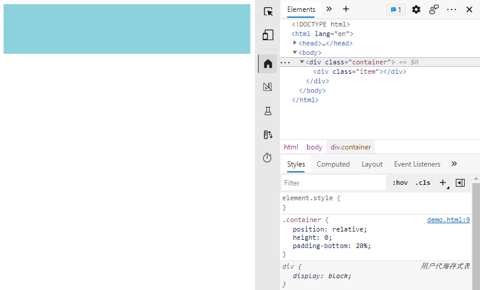

## 分析

`padding` 的百分比取值为父级容器的宽度，设置 `padding` 的百分比值即可创建固定比例的盒子。



## 代码

```css
.container {
  position: relative;
  height: 0;
  /* padding-bottom 即为长度占宽度的百分比 */
  padding-bottom: 50%;
}

.item {
  position: absolute;
  top: 0;
  left: 0;
  width: 100%;
  height: 100%;
  background-color: #8bd3dd;
}
```
